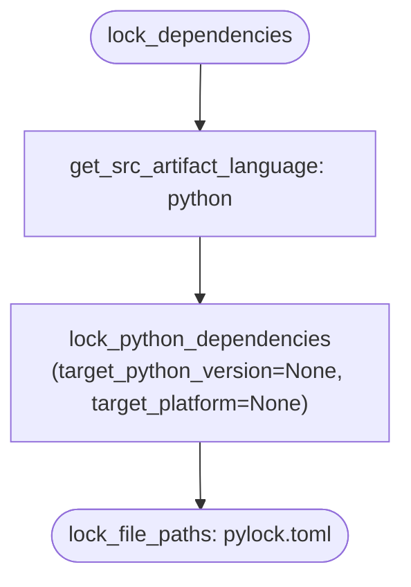
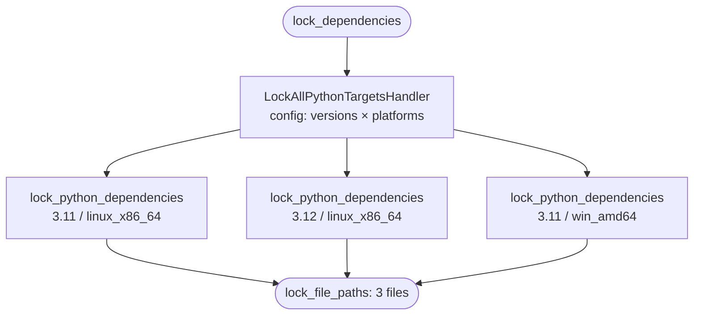
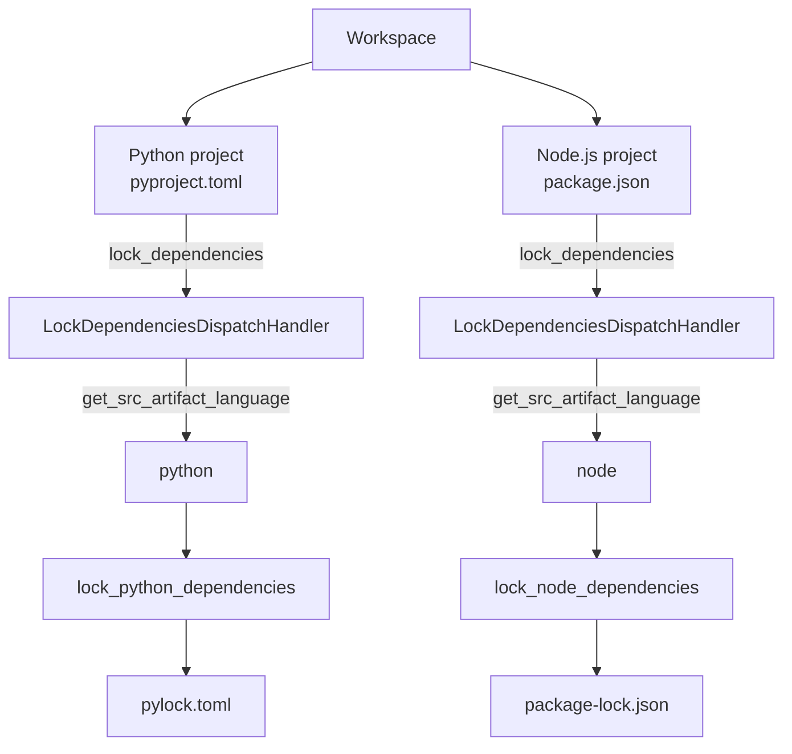

# Designing Actions Reference

This is the detailed reference for FineCode action design patterns. Use it when
the first-action guide is too small for the action you are building: language
subactions, item and collection boundaries, bridge handlers, partial results,
progress, context state, workspace scope, and naming conventions.

If you are starting fresh, use this order:

1. Start with [Designing Your First Action](designing-actions-guide.md) for the
   happy-path implementation.
2. Use this reference when your action needs a pattern beyond the simple path.
3. Return to the [Designing Actions Rules](designing-actions-rules.md) before
   merging to sanity-check that the action contract still matches the framework
   model.

## Recommended workflow

When designing a new action, work through these questions in order:

1. **What is the cross-language contract?** Start with [Actions are inter-language](#actions-are-inter-language), [Cover different use cases, don't enforce a single model](#cover-different-use-cases-dont-enforce-a-single-model), and [Prefer multiple focused actions over one overloaded action](#prefer-multiple-focused-actions-over-one-overloaded-action).
2. **Do I need a language-specific subaction?** See [Language-specific subactions](#language-specific-subactions).
3. **Which inputs come from the caller, project config, or runtime discovery?** See [Inputs discoverable from project context](#inputs-discoverable-from-project-context).
4. **Is this an item action or a collection action?** See [Item actions and collection actions](#item-actions-and-collection-actions).
5. **How should multiple handlers interact?** See [Handler execution strategy](#handler-execution-strategy).
6. **Does the context hold mutable state that handlers share?** See [Run context state](#run-context-state).
7. **Will the action delegate to other actions?** See [Bridge handlers](#bridge-handlers), [Discovery + bridge handler pattern](#discovery-bridge-handler-pattern), and [Passing caller-provided state to a child run context](#passing-caller-provided-state-to-a-child-run-context).
8. **Should the action stream results or report progress?** See [Partial results and progress](#partial-results-and-progress).
9. **Is the action named and documented clearly enough for MCP callers?** Finish with [Recommended naming conventions for actions and handlers](#recommended-naming-conventions-for-actions-and-handlers) and [Documenting actions and fields](#documenting-actions-and-fields).

This page is intentionally broad. You do not need to read it end-to-end before
creating a simple action.

## Terms used on this page

- **Action**: the caller-facing contract — payload, run context, result, and metadata.
- **Handler**: an implementation of an action, usually provided by an extension or built-in package.
- **Preset**: a package or configuration layer that registers actions and handlers for a feature.
- **WM**: Workspace Manager, the process that owns workspace/project routing.
- **ER**: Extension Runner, the process that runs handlers.
- **MCP**: Model Context Protocol, the tool-facing interface used by AI clients.
- **DI**: dependency injection, used to provide services such as file editors, loggers, and action runners to handlers.

## Actions are inter-language

Action payloads and results should express concepts that are meaningful regardless of the programming language or ecosystem. A `LockDependenciesAction` should not contain a `target_python_version` field because an equivalent action for Node.js or Rust would have completely different (or no) equivalent parameters.

A cross-language action class lives in the **feature preset package** that registers it (e.g. `FormatFileAction` in `fine_format`, `LintAction` in `fine_lint`). The contract and its canonical registration ship as one unit — see [ADR-0036](../adr/0036-feature-presets-own-their-action-contracts.md). Language-specific subactions follow the same rule one level down: they live in the matching `fine_<lang>_<role>` preset.

Keep the generic action payload to concepts that translate across all languages:

```python
# Good — meaningful in any ecosystem
@dataclasses.dataclass
class LockDependenciesRunPayload(code_action.RunActionPayload):
    src_artifact_def_path: pathlib.Path
    output_dir: pathlib.Path

# Avoid — Python-specific in a generic action
@dataclasses.dataclass
class LockDependenciesRunPayload(code_action.RunActionPayload):
    src_artifact_def_path: pathlib.Path
    output_dir: pathlib.Path
    target_python_version: str | None = None   # wrong level
    target_platform: str | None = None         # wrong level
```

## Cover different use cases, don't enforce a single model

Design actions to accommodate multiple valid workflows rather than assuming one tool's model. For example, Python lock files can be:

- **Per-platform** (pip-tools model): one lock file per `(python_version, platform)` combination, generated by running the action multiple times
- **Universal** (uv model): one lock file with environment markers covering all platforms

An action that hardcodes either model would exclude the other. Instead, keep the action generic (`output_dir` is caller-controlled) and let the handler and its configuration determine which model to use.

## Prefer multiple focused actions over one overloaded action

When different use cases require genuinely different payloads or semantics, define separate actions rather than adding optional fields that only apply in some scenarios.

Optional fields that are only meaningful for certain tools or workflows are a sign that the action is trying to cover too much. A handler that ignores half the payload fields, or a payload where only some field combinations are valid, indicates the action boundary is in the wrong place.

## Language-specific subactions

When an action requires parameters that are **ecosystem-specific but tool-independent**, create a language-specific subaction rather than placing those parameters in handler configuration.

### The three levels of specificity

| Level | What it carries | Example |
| --- | --- | --- |
| Generic action | cross-language concepts | `LockDependenciesAction`: `src_artifact_def_path`, `output_dir` |
| Language-specific subaction | ecosystem parameters | `LockPythonDependenciesAction`: + `target_python_version`, `target_platform` |
| Handler config | tool parameters | pip-compile handler: `generate_hashes`, header; uv handler: resolution strategy |

### When to create a language-specific subaction

Create a subaction when:

- There are parameters that apply to **all tools in an ecosystem** but not to tools in other ecosystems
- Users should be able to swap tools without reconfiguring ecosystem-level parameters
- The generic action's payload would need optional fields that are meaningless outside one language
- **The action dispatches to language-specific handlers** — even when the payload has no extra language fields, a subaction is required so that a dispatch handler has a routing target and Python handlers do not run on JavaScript files (and vice versa)

The last point is the most commonly missed. The absence of extra payload fields on the subaction is **not** a reason to skip it. Routing and payload extension are independent concerns: a subaction with no new payload fields is a perfectly valid and common design.

The generic action can still exist as a base case — useful for ecosystems where handler config is sufficient, or as a conceptual anchor in the action hierarchy.

### Declaring the relationship

Language-specific subactions declare their target language and parent action via class-level attributes so that dispatch handlers can discover them reliably (see [ADR-0008](../adr/0008-explicit-specialization-metadata-for-language-actions.md)):

```python
class LintPythonFilesAction(code_action.Action[...]):
    """Lint Python source files and report diagnostics."""
    LANGUAGE = "python"
    PARENT_ACTION = LintFilesAction
    PAYLOAD_TYPE = LintFilesRunPayload
    # ...

class LockPythonDependenciesAction(code_action.Action[...]):
    """Generate a lock file for a Python artifact's dependencies."""
    LANGUAGE = "python"
    PARENT_ACTION = LockDependenciesAction
    PAYLOAD_TYPE = LockPythonDependenciesRunPayload
    # ...
```

Both attributes are required for language-specific subactions. `LANGUAGE` alone is ambiguous (multiple generic actions may have Python specializations) and `PARENT_ACTION` alone doesn't tell the dispatch handler which language group to route to.

### Extended payload fields must have defaults

When a language-specific subaction extends the parent payload with ecosystem-specific parameters, those fields must have defaults that are meaningful for the dispatch case — typically `None` meaning "auto-detect from project configuration or environment":

```python
@dataclasses.dataclass
class LockPythonDependenciesRunPayload(LockDependenciesRunPayload):
    target_python_version: str | None = None   # None = running interpreter
    target_platform: str | None = None         # None = current platform
```

The dispatch handler constructs subaction payloads generically from the parent payload fields. Extended fields receive their defaults. Workflows that require specific values for ecosystem parameters must use a specialized handler on the generic action (e.g. `LockAllPythonTargetsHandler` with configured target versions) or invoke the language-specific action directly.

## Inputs discoverable from project context

Some action inputs are not specified by the caller — they are derived from the project's current state or configuration. There are two distinct sub-problems, each with a different solution.

### Dynamic discovery: optional payload field + discovery handler

Use this pattern when the input value depends on **runtime state** — for example, which files or directories currently exist.

Mark the payload field optional with `None` meaning "discover" and `[]` (or empty) meaning "explicit no-op":

```python
@dataclasses.dataclass
class IngestWalToStoreRunPayload(code_action.RunActionPayload):
    source_specs: list[WalSourceSpec] | None = None
    """WAL sources to ingest.
    None = discover from project env WAL directories.
    Empty list = explicit no-op (nothing to ingest)."""
```

Add matching state to the run context. Prefer `STATE_TYPE` for values that may
be read or written by multiple handlers, because it survives cross-env handler
boundaries. `context.init()` pre-populates it from the payload when explicit, so
downstream handlers only ever read the context state — never the payload:

```python
@dataclasses.dataclass
class IngestWalToStoreContextState:
    source_specs: list[WalSourceSpec] | None = None


class IngestWalToStoreRunContext(code_action.RunActionContext[IngestWalToStoreRunPayload]):
    STATE_TYPE = IngestWalToStoreContextState

    async def init(self) -> None:
        if (
            self.state.source_specs is None
            and self.initial_payload.source_specs is not None
        ):
            self.state.source_specs = list(self.initial_payload.source_specs)
```

Add a discovery handler as the **first handler** in the sequential chain. It
populates `context.state.source_specs` when `None` and is a no-op when already
set:

```python
class DiscoverWalSourcesHandler(code_action.ActionHandler[IngestWalToStoreAction, ...]):
    async def run(self, payload, run_context):
        if run_context.state.source_specs is not None:
            return IngestWalToStoreRunResult(...)  # already populated, skip

        # Discover: check which env WAL directories exist
        env_names = ...  # from project config dependency-groups
        specs = []
        for env_name in env_names:
            wal_dir = venv_root / env_name / "state" / "finecode" / "wal" / "wm"
            if wal_dir.exists():
                specs.append(WalSourceSpec(
                    source_id=env_name,
                    format="jsonl",
                    location_uri=path_to_resource_uri(wal_dir),
                ))
        run_context.state.source_specs = specs
        return IngestWalToStoreRunResult(...)
```

Downstream handlers read `run_context.state.source_specs` and can assume it is
always set.

**Key rules:**

- `None` means "system should discover"; `[]` means "caller explicitly says nothing to process"
- The context state field is the single source of truth after `init()` — no handler should re-check `payload.source_specs`
- The discovery handler must be first in the SEQUENTIAL chain
- Document the `None` / `[]` semantics in the payload field's attribute docstring

### Custom run context constructors must forward framework-injected senders

If a `RunActionContext` subclass defines its own `__init__`, it must accept and forward the framework-injected sender parameters from the base class. In practice, this especially means `progress_sender`, and for contexts that use partial-result features it may also include `partial_result_sender`.

If you omit these parameters, the action still runs, but framework features silently degrade to no-ops. A common failure mode is that `run_context.progress(...)` appears in handler code but emits nothing because the custom context constructor never forwarded `progress_sender` to `super().__init__(...)`.

```python
class MyRunContext(code_action.RunActionContext[MyRunPayload]):
    def __init__(
        self,
        run_id: int,
        initial_payload: MyRunPayload,
        meta: code_action.RunActionMeta,
        info_provider: code_action.RunContextInfoProvider,
        progress_sender: code_action.ProgressSender = code_action._NOOP_PROGRESS_SENDER,
    ) -> None:
        super().__init__(
            run_id=run_id,
            initial_payload=initial_payload,
            meta=meta,
            info_provider=info_provider,
            progress_sender=progress_sender,
        )
```

When possible, prefer not overriding `__init__` at all. If you do override it, keep it compatible with the base `RunActionContext` constructor unless you have a concrete reason not to.

See `finecode_builtin_handlers/src/finecode_builtin_handlers/install_envs_discover_envs_handler.py`
for a concrete example of this constructor-forwarding pattern.
<!-- 
This is currently still an idea, not implemented:
### Static defaults: payload defaults from project config

Use this pattern when the input has a **known, stable project-level value** — for example, a preferred store URI or output path — that doesn't change based on runtime state.

Configure default values for payload fields in `pyproject.toml`:

```toml
[tool.finecode.action.ingest_wal_to_store.payload_defaults]
store_uri = "file:///home/user/.local/share/finecode/wal.db"
```

The framework merges these defaults with caller-provided params before constructing the payload. Caller-provided values always win. The payload type requires no changes — required fields stay required:

```python
@dataclasses.dataclass
class IngestWalToStoreRunPayload(code_action.RunActionPayload):
    source_specs: list[WalSourceSpec]   # still required — must be provided or have a default
    store_uri: ResourceUri | None = None
```

This is analogous to how handler configs work: project owners configure them in `pyproject.toml`, and the framework binds them to typed objects before execution.

**Key rules:**

- Use for stable, configuration-like values — not values that depend on runtime filesystem state
- Full replacement semantics for list fields: if a default is `[A, B]` and the caller provides `[C]`, the result is `[C]`, not `[A, B, C]`
- Document any payload field with a `payload_defaults` use-case in its attribute docstring

### Choosing between the two patterns

| Input kind | Example | Pattern |
| --- | --- | --- |
| Depends on runtime state (files, dirs, installed envs) | WAL source dirs that currently exist | Dynamic discovery |
| Stable project-level setting | Store URI, preferred port | Static defaults |

The two patterns can coexist in the same action: `source_specs` uses dynamic discovery while `store_uri` uses static defaults. -->

## Item actions and collection actions

When an action processes multiple items (files, tests, artifacts), there are two ways to design the action boundary:

**Item action** — the payload carries a single item, the result describes that one item:

```python
@dataclasses.dataclass
class FormatFileRunPayload(code_action.RunActionPayload):
    file_path: ResourceUri
    save: bool

@dataclasses.dataclass
class FormatFileRunResult(code_action.RunActionResult):
    changed: bool
    code: str
```

When an item action needs runtime state from a parent (e.g. a shared file editor session), use `CallerRunContextKwargs` — see [Passing caller-provided state to a child run context](#passing-caller-provided-state-to-a-child-run-context).

**Collection action** — the payload carries a list of items, the result is keyed per item:

```python
@dataclasses.dataclass
class FormatFilesRunPayload(
    code_action.RunActionPayload, collections.abc.AsyncIterable[ResourceUri]
):
    file_paths: list[ResourceUri]
    save: bool

@dataclasses.dataclass
class FormatFilesRunResult(code_action.RunActionResult):
    result_by_file_path: dict[ResourceUri, FormatRunFileResult]
```

Both are standard `Action` subclasses — no special framework support is needed. The distinction is about design intent: what contract do handlers and callers work with?

See [ADR-0012](../adr/0012-item-level-and-collection-level-action-granularity.md) for the architectural decision behind this convention.

### Result field scope: design for within-project merging only

Action results are scoped to a single project. The framework does not merge results across projects — the WM's `runBatch` API returns a dict keyed by project path, and any caller that needs a cross-project view either consumes per-project entries directly or performs its own aggregation with domain knowledge of what "merged" means for their use case.

This means `RunActionResult.update()` only has to handle **intra-project** merging: partial-result streaming from a handler, and delegated sub-action results consumed by a parent handler. Within one project, most identifying keys (file URIs, environment names, hook types, handler names) are already unique, and list extension or dict update merge cleanly.

Do not design result fields for cross-project aggregation. A list of "skipped projects" or a dict keyed by project path inside a project-level result is a sign that the aggregation concern has leaked into the wrong layer — the same information is already present in the WM's per-project return structure, and the caller is the right place to join it with domain knowledge.

When a partial result represents a project-wide outcome — for example, "this project was skipped, and here is why" — a scalar field is appropriate. Within one project, the value is scalar by definition, and `update()` adopts the latest non-empty value:

```python
@dataclasses.dataclass
class InstallGitHooksRunResult(code_action.RunActionResult):
    installed_hooks: list[str] = dataclasses.field(default_factory=list)
    skipped_hooks: list[str] = dataclasses.field(default_factory=list)
    skip_reason: str | None = None  # project-wide no-op, e.g. no .git

    def update(self, other):
        if not isinstance(other, InstallGitHooksRunResult):
            return
        self.installed_hooks.extend(other.installed_hooks)
        self.skipped_hooks.extend(other.skipped_hooks)
        if other.skip_reason is not None:
            self.skip_reason = other.skip_reason
```

See [ADR-0017](../adr/0017-action-results-are-scoped-to-a-single-project.md) for the architectural decision behind this rule.

### Choosing item vs collection boundaries

Use an **item action** when:

- Each tool processes one item independently (formatters, simple per-file checks)
- The primary callers have a single item
- You want simple handlers: one item in, one result out — no list iteration or `partial_result_scheduler`
- Handlers run sequentially and order matters (e.g. isort before ruff) — at the item level, the framework's native sequential execution handles this directly, without relying on `partial_result_scheduler` insertion order
- Progress is owned by a parent orchestrator, not by the item action itself

Use a **collection action** when:

- Tools benefit from seeing all items at once (cross-file analysis, batch optimization, shared caches)
- The primary callers have batches (project-wide format, CI lint)
- Handlers iterate items and use `partial_result_scheduler` for per-item results
- The action itself owns progress via the iterable payload model

### Choosing a main handler action

When both item and collection actions exist for the same kind of operation, one usually serves as the **main handler action** — the action where the main handler logic naturally lives. The other action adapts.

**Item-primary** (main handlers attach to the item action):

```text
format_files               ← collection orchestrator
  └── format_python_files  ← iterates, delegates per file
        ↓
format_file                ← item action (primary)
  └── format_python_file   ← handlers register here
```

Choose item-primary when most handlers process one item independently. The collection level provides orchestration (iteration, progress, partial results) without handler involvement.

**Collection-primary** (main handlers attach to the collection action):

```text
lint_files                 ← collection action (primary)
  └── lint_python_files    ← handlers register here

lint_file                  ← item convenience (optional)
  └── lint_python_file     ← delegates to lint_python_files([file])
```

Choose collection-primary when handlers benefit from the full item list — for example, a type checker that needs all files for cross-module analysis, or a linter that resolves imports across the file set. In this design, the collection action is the real contract. The item action is optional and exists only when a cleaner single-item API is worth the additional action surface.

### Separate batch-oriented collection actions

An item-primary design may still need a batch-oriented collection contract for tools that benefit from the full item set.

- `format_python_files` contains the default collection-level handler that iterates and calls `format_python_file` per file.
- If a future batch-optimized contract is needed (for example, a CLI tool that formats all files in one invocation), define it as a separate action or specialized subaction rather than as an additional handler in the same invocation path.

This keeps the common case simple (per-item handlers on the item action) while preserving a clear collection-level execution path for each invocation.

### Applying language subactions at both levels

Language-specific specialization applies independently at each granularity level. An item-primary design like formatting may have:

| Level      | Generic        | Language-specific                                           |
|------------|----------------|-------------------------------------------------------------|
| Item       | `format_file`  | `format_python_file` (`PARENT_ACTION = FormatFileAction`)   |
| Collection | `format_files` | `format_python_files` (`PARENT_ACTION = FormatFilesAction`) |

A collection-primary design like linting may have:

| Level      | Generic                 | Language-specific                                        |
|------------|-------------------------|----------------------------------------------------------|
| Collection | `lint_files`            | `lint_python_files` (`PARENT_ACTION = LintFilesAction`)  |
| Item       | `lint_file` (optional)  | `lint_python_file` (optional)                            |

The item level in a collection-primary design is a convenience — it exists only when single-item callers benefit from a cleaner API, not because handlers need it. If that convenience adds no real value, omit the item action and use the collection action directly, even for a single-item batch.

### Registering handlers on the generic action vs. the language-specific subaction

At any level where a generic action and language-specific subactions coexist, you must decide where a handler belongs. The choice applies equally at the collection level (`lint_files` vs `lint_python_files`) and at the item level (`format_file` vs `format_python_file`).

**Handlers on the generic action** run for every language. They can only use the generic payload and context — they cannot access language-specific fields. Useful for language-agnostic work: saving files, normalising encodings, aggregating results.

**Handlers on a language-specific subaction** have access to language-specific payload fields and context. They must be registered per language — a handler on `format_python_file` does not run for JavaScript files.

The trade-off:

| | Generic action | Language-specific subaction |
| --- | --- | --- |
| Applies to | All languages | One language |
| Payload access | Generic fields only | Generic + language-specific fields |
| Registration cost | Once | Once per language |
| Right choice when | Work is truly language-agnostic | Work needs language-specific parameters or context |

**Example.** In an item-primary formatting design with a generic `format_file` and language-specific `format_python_file`:

- `SaveFormatFileHandler` belongs on `format_file` — saving a file is the same regardless of language.
- `IsortFormatFileHandler` belongs on `format_python_file` — import sorting is Python-specific.

If `format_file` is used as an intermediary between `format_python_files` and `format_python_file`, a dispatch handler on `format_file` calls the language-specific item subaction and must bridge context before the next generic handler (save) runs:

```python
# FormatFileDispatchHandler.run() — bridges generic and language-specific levels
result = await self.action_runner.run_action(lang_subaction, single_file_payload, meta)
# update the generic context so the downstream save handler sees the latest code
run_context.file_info = FileInfo(file_content=result.code, ...)
# SaveFormatFileHandler runs next and reads run_context.file_info
```

**Constraint: language-specific payload fields cannot cross a generic level.** If `format_python_files` carries a Python-specific runtime parameter that `format_python_file` handlers need, it cannot be passed through `format_file` — the generic payload has no slot for it. When such parameters exist, go directly from the language-specific collection subaction to the language-specific item subaction, and keep generic handlers at the collection level instead.

In practice, most language-specific runtime variation lives in handler configuration (formatter profile, target version), not in the runtime payload. When that holds, registering cross-language handlers on the generic action is clean and the bridging pattern above is sufficient.

## Handler execution strategy

When an action has multiple handlers, they interact in one of two ways:

- **Sequential** (default): handlers form a pipeline — each handler's output feeds the next handler's input. Handler order is part of the action's semantics. Example: formatting (isort → ruff → save).
- **Concurrent**: handlers are independent analyzers — each produces its own results without depending on other handlers. Handler order is irrelevant. Example: linting (ruff + mypy).

The action definition declares this via a class-level attribute:

```python
class FormatPythonFileAction(code_action.Action[...]):
    """Format a single Python file."""
    HANDLER_EXECUTION = HandlerExecution.SEQUENTIAL   # default

class LintPythonFilesAction(code_action.Action[...]):
    """Lint Python source files and report diagnostics."""
    HANDLER_EXECUTION = HandlerExecution.CONCURRENT
```

See [ADR-0013](../adr/0013-action-declares-handler-execution-strategy.md) for the architectural decision.

### The action designer owns this decision

The execution strategy describes a relationship between handlers — not a property of any single handler. An isort handler cannot know it needs to run before ruff. A ruff lint handler cannot know it is safe to run alongside mypy. Only the action designer, who defines the handler pipeline, has this knowledge.

Individual handlers should not declare or influence the execution strategy. If handlers could independently declare `concurrent=True/False`, mismatching values would lead to silent bugs — and the "correct" resolution would require knowledge that no single handler possesses.

### Two orthogonal concurrency dimensions

Handler execution strategy and item-level parallelism are independent decisions at different levels:

- **Handler interaction within one item**: declared by the action definition (`HANDLER_EXECUTION`). Sequential for transform pipelines, concurrent for independent analyzers.
- **Item-level parallelism across items**: controlled by the collection orchestrator (e.g. `TaskGroup`). Different items can be processed in parallel regardless of the handler execution strategy within each item.

A formatting action may run handlers sequentially per file (isort → ruff → save) while processing different files concurrently. These dimensions compose without interference.

### Designing results for concurrent handlers

When `HANDLER_EXECUTION = CONCURRENT`, each handler produces an independent partial result that is merged into the final result via `RunActionResult.update()`. For this merge to be correct, the result type must carry **domain-model data** — absolute positions, business objects, plain values — not pre-encoded or delta-encoded wire-format data.

**Why wire format breaks concurrent merging.** Consider a result type that stores tokens as a delta-encoded integer array (where each position is relative to the previous token). Handler A and Handler B each produce a valid array independently. Appending the two arrays gives an invalid result: Handler B's first token is encoded relative to Handler B's own baseline, not relative to the last token in Handler A's output. The client decodes incorrect absolute positions.

The fix: store tokens as a list of absolute-position objects. Each `update()` call extends the list — safe because absolute positions are independent of order. The wire-format encoding (sorting, delta compression) happens **once** at the endpoint after all handlers have contributed, never inside the result type.

**Rule of thumb:** if you find yourself writing delta-encoding or any position-relative arithmetic inside a handler or `update()`, it is a sign that the result is carrying a wire format that belongs at the endpoint layer.

### No mixed execution — split instead

If an action seems to need both concurrent and sequential handlers, it is combining distinct concerns. Split it into focused actions with clear execution strategies and chain them via an orchestrating handler.

For example, if an action needs a setup phase (sequential) followed by an analysis phase (concurrent):

```text
analyze_project                   ← orchestrating action
  handler: AnalyzeProjectHandler  ← calls both subactions in sequence
    ↓
  analyze_setup                   ← HANDLER_EXECUTION = SEQUENTIAL
    handler: BuildIndexHandler
    handler: WarmCacheHandler
    ↓
  analyze_files                   ← HANDLER_EXECUTION = CONCURRENT
    handler: TypeCheckHandler
    handler: StyleCheckHandler
```

This keeps each action's execution model predictable and visible in the action definition.

### How handler execution interacts with `partial_result_scheduler`

In collection actions with iterable payloads, handlers schedule per-item coroutines via `partial_result_scheduler.schedule(key, coro)`. The framework runs these per-key coroutines according to the action's declared execution strategy:

- **Sequential actions**: per-key coroutines run in schedule order. This preserves handler ordering — the first handler's coroutine runs before the second handler's coroutine for each key. The ordering is a contractual guarantee, not an implementation detail.
- **Concurrent actions**: per-key coroutines run in parallel. Each handler's coroutine is independent.

Handlers do not specify the execution strategy when scheduling — they just call `schedule(key, coro)`. The action's `HANDLER_EXECUTION` determines how those coroutines execute.

Note that for **item-primary actions** (see [Item actions and collection actions](#item-actions-and-collection-actions)), sequential handler chaining at the item level does not involve the scheduler at all — the framework runs handlers sequentially as a native part of action execution. The scheduler interaction described above applies only to the collection level.

### Two patterns for sending partial results

There are two patterns for sending partial results from a collection action handler. Which one to use depends on whether the handler *is* the item processor or *dispatches* to other actions.

**Pattern 1 — `partial_result_scheduler` (leaf handlers)**

Use this when the handler itself computes the per-item result. The handler iterates the payload, schedules one coroutine per item keyed by the payload element, and the framework drives execution:

```python
async def run(self, payload, run_context):
    file_uris = [uri async for uri in payload]
    for file_uri in file_uris:
        run_context.partial_result_scheduler.schedule(
            file_uri,                          # key — must match a value yielded by payload.__aiter__()
            self._lint_single_file(file_uri),  # coroutine — returns result for that key
        )
```

The framework iterates the payload independently, matches each yielded value against the scheduler's keys, and runs the coroutines according to the action's `HANDLER_EXECUTION` strategy. The coroutine return values become the partial results and are also accumulated into the final result.

**Key constraint**: the scheduler key must exactly match a value yielded by `payload.__aiter__()`. A mismatch silently drops results — the framework logs a warning and skips the part.

```python
# Correct: payload.__aiter__() yields the same ResourceUri objects used as keys.
for file_uri in [uri async for uri in payload]:
    run_context.partial_result_scheduler.schedule(file_uri, lint_one(file_uri))

# Wrong: payload.__aiter__() yields ResourceUri objects, but the keys are strings.
# The scheduled results will not match the payload items.
for file_uri in [uri async for uri in payload]:
    run_context.partial_result_scheduler.schedule(str(file_uri), lint_one(file_uri))
```

**Pattern 2 — direct `partial_result_sender.send()` (dispatch handlers)**

Use this when the handler delegates to subactions via `run_action_iter` and forwards their partial results upward. The handler does not use the scheduler at all — it manages its own concurrency with `asyncio.TaskGroup` and sends partials directly:

```python
async def _lint_lang(self, subaction, file_uris, meta, partial_result_sender):
    async for partial in self.action_runner.run_action_iter(
        action=subaction,
        payload=LintFilesRunPayload(file_paths=file_uris),
        meta=meta,
    ):
        await partial_result_sender.send(partial)

async def run(self, payload, run_context):
    # ... group files by language ...
    async with asyncio.TaskGroup() as tg:
        for lang, file_uris in files_by_lang.items():
            tg.create_task(
                self._lint_lang(subactions_by_lang[lang], file_uris, meta,
                                run_context.partial_result_sender)
            )
```

The framework detects that the handler used direct sends and skips the scheduler loop entirely. For streaming callers (`run_action_iter`), partial results arrive as subactions yield them. For non-streaming callers (`run_action`), the framework accumulates all sent results into the final return value.

| | Scheduler pattern | Direct send pattern |
| --- | --- | --- |
| Handler role | Computes item results itself | Delegates to subactions |
| Item concurrency | Controlled by the framework | Controlled by the handler (`TaskGroup`) |
| Cross-language dispatch | Not applicable | Natural fit |
| Streaming support | Yes | Yes |
| Non-streaming support | Yes | Yes (accumulated automatically) |

## Run context state

When a `RunActionContext` subclass holds mutable state that multiple handlers
read and write — discovered file lists, normalized values, shared flags — that
state should live in a dedicated `@dataclass` declared as `STATE_TYPE` on the
context class:

```python
@dataclasses.dataclass
class LintContextState:
    discovered_files: list[str] = dataclasses.field(default_factory=list)

class LintRunContext(RunActionContext[LintRunPayload]):
    STATE_TYPE = LintContextState
    # Framework creates context.state = LintContextState() automatically
```

Handlers read and write shared state via `run_context.state`:

```python
class DiscoverFilesHandler(ActionHandler[LintAction, ...]):
    async def run(self, payload, run_context):
        run_context.state.discovered_files = await self._discover(payload)
        return LintRunResult()

class LintHandler(ActionHandler[LintAction, ...]):
    async def run(self, payload, run_context):
        for f in run_context.state.discovered_files:
            ...
```

The motivation is forward-compatibility. The action designer does not know the
future env layout: a configuration that is single-env today may become multi-env
when a project owner or preset author adds a handler from a different package.
Context state that is not declared serializable is silently lost at any env
boundary it crosses. Declaring `STATE_TYPE` ensures the action works correctly
regardless of how handlers are distributed across envs.

### What belongs in `state` vs. on the context directly

`STATE_TYPE` must contain only plain, JSON-serializable values. Non-serializable
objects must remain as direct attributes on the context:

| `context.state.field` | `self.field` on the context directly |
| --- | --- |
| Discovered file lists, paths as strings | DI-resolved services |
| Normalized values, flags, counts | Progress sender, partial-result sender |
| Any plain JSON-serializable value | Async resources, open file handles |

Placing a non-serializable object inside `state` fails at serialization time
when handlers cross an env boundary, making the mistake visible early rather
than silently dropping data.

### Initialization

The framework creates `context.state = STATE_TYPE()` automatically when the
context is instantiated, so the `@dataclass` default values are always in place.
Override `init()` only when first-segment setup requires work beyond the
defaults — for example, pre-populating from the payload:

```python
class LintRunContext(RunActionContext[LintRunPayload]):
    STATE_TYPE = LintContextState

    async def init(self) -> None:
        if self.initial_payload.file_paths:
            self.state.discovered_files = [
                str(p) for p in self.initial_payload.file_paths
            ]
```

When state is restored from a prior env segment, `restore_context` runs before
`init()`. Guard `init()` against overwriting already-restored values:

```python
async def init(self) -> None:
    if not self.state.discovered_files:   # skip if already restored
        self.state.discovered_files = await self._discover()
```

### Complex field types

`dataclasses.asdict` serializes plain types correctly but fails on complex
values such as `Path`, `set`, or custom classes. For those cases, override
`serialize_context` and `restore_context`:

```python
class LintRunContext(RunActionContext[LintRunPayload]):
    STATE_TYPE = LintContextState

    def serialize_context(self) -> dict | None:
        return {"discovered_files": [str(f) for f in self.state.discovered_files]}

    def restore_context(self, data: dict) -> None:
        self.state = LintContextState(
            discovered_files=[Path(f) for f in data.get("discovered_files", [])],
        )
```

See [ADR-0025](../adr/0025-cross-env-context-state-dedicated-state-type.md) for
the architectural rationale behind this pattern.

## Bridge handlers

A handler registered on Action A sometimes needs to call Action B — for example, to discover a missing input, route to a language-specific subaction, split a collection into items, or compose a multi-step workflow. Because A and B have different contracts (payload, context, result), the handler translates between them: it maps A's payload/context to B's payload, calls B, and maps B's result back into A's contract or context.

This translation layer is a **bridge handler**. The general shape:

```python
class SomeBridgeHandler(code_action.ActionHandler[ActionA, ...]):
    async def run(self, payload, run_context):
        # 1. Construct B's payload from A's payload/context
        b_payload = ActionBRunPayload(field=payload.some_field)

        # 2. Call Action B
        b_result = await self.action_runner.run_action(
            action=self.action_runner.get_action_by_source(ActionB),
            payload=b_payload,
            meta=run_context.meta,
        )

        # 3. Map B's result back to A's contract
        #    Either return A's result type:
        return ActionARunResult(derived_field=b_result.b_field)
        #    Or update A's context state for downstream handlers:
        run_context.state.some_field = b_result.b_field
```

The examples in this section use `action_runner` (which calls actions within the same extension runner), but the pattern applies equally to any action runner — including project-level and workspace-level runners that can call actions across projects and environments.

Bridge handlers are not a framework feature — they are plain handlers that happen to call other actions. The distinction is conceptual: recognizing the pattern helps name handlers consistently and reason about action composition.

Four subtypes appear frequently:

### Discovery bridge handler

A handler that calls another action to populate a value that downstream handlers need. It is typically the first handler in a sequential chain and is a no-op when the value is already provided.

This subtype implements the handler side of the [dynamic discovery](#dynamic-discovery-optional-payload-field-discovery-handler) pattern. The payload and context design (optional field with `None`/`[]` semantics, context state as single source of truth) is described in that section. The bridge handler's only job is to call the discovery action and write the result into the context state:

```python
class IngestWalSourceDiscoveryHandler(
    code_action.ActionHandler[IngestWalToStoreAction, ...]
):
    async def run(self, payload, run_context):
        if run_context.state.source_specs is not None:
            return IngestWalToStoreRunResult()  # already populated, skip

        discover_result = await self.action_runner.run_action(
            action=self.action_runner.get_action_by_source(DiscoverWalSourcesAction),
            payload=DiscoverWalSourcesRunPayload(),
            meta=run_context.meta,
        )
        run_context.state.source_specs = discover_result.source_specs
        return IngestWalToStoreRunResult()
```

Compare this to the inline discovery handler shown in [Dynamic discovery](#dynamic-discovery-optional-payload-field-discovery-handler), which discovers values directly without calling another action. The bridge variant is appropriate when the discovery logic is complex enough to warrant its own action with its own handlers and contract.

### Dispatch bridge handler

A handler that routes from a generic action to a more specific action based on a runtime criterion — typically the file's language. After the sub-action returns, the handler may need to update the parent context so downstream handlers see the result:

```python
class FormatFileDispatchHandler(code_action.ActionHandler[FormatFileAction, ...]):
    async def run(self, payload, run_context):
        # detect language, find subaction
        lang_subaction = subactions_by_lang[detected_lang]

        result = await self.action_runner.run_action(
            action=lang_subaction,
            payload=FormatFileRunPayload(file_path=payload.file_path, save=payload.save),
            meta=run_context.meta,
        )

        # bridge context for downstream handlers (e.g. save)
        if result.changed:
            run_context.file_info = FileInfo(file_content=result.code, ...)
        return result
```

For collection-level dispatch (e.g. `LintFilesDispatchHandler`), the handler groups items by language and dispatches each group to the matching language subaction concurrently — see [Two patterns for sending partial results](#two-patterns-for-sending-partial-results).

### Iterate bridge handler

A handler on a collection action that splits the payload into individual items and delegates each to an item action. This changes the granularity from collection to item:

```python
class FormatFilesIterateHandler(
    code_action.ActionHandler[FormatFilesAction, ...]
):
    async def run(self, payload, run_context):
        for file_uri in payload.file_paths:
            run_context.partial_result_scheduler.schedule(
                file_uri,
                self._format_one_file(file_uri, payload.save, run_context),
            )
```

The iterate handler bridges the collection contract to the item contract. It constructs per-item payloads, calls the item action, and maps item results back to the collection result shape. When the parent needs to pass runtime state to the child, use [`CallerRunContextKwargs`](#passing-caller-provided-state-to-a-child-run-context).

See [Item actions and collection actions](#item-actions-and-collection-actions) for when to use item-primary vs. collection-primary designs.

### Orchestrating bridge handler

A handler that composes multiple sub-actions in sequence, each with its own contract. The handler manages the workflow — calling one sub-action, extracting what it needs from the result, and passing it to the next:

```python
class PublishAndVerifyArtifactHandler(
    code_action.ActionHandler[PublishAndVerifyArtifactAction, ...]
):
    async def run(self, payload, run_context):
        # Step 1: publish
        publish_result = await self.action_runner.run_action(
            action=..., payload=PublishArtifactRunPayload(...), meta=run_context.meta
        )
        # Step 2: get version from dist
        version_result = await self.action_runner.run_action(
            action=..., payload=GetDistArtifactVersionRunPayload(...), meta=run_context.meta
        )
        # Step 3: verify each registry
        for registry in publish_result.published_registries:
            await self.action_runner.run_action(
                action=..., payload=VerifyRunPayload(...), meta=run_context.meta
            )
        return PublishAndVerifyArtifactRunResult(...)
```

When composing a finite step with an indefinitely-running step, use `run_action_iter` to receive partial results from the long-running sub-action before it completes.

#### Receiving partial results from a sub-action

`run_action(sub_action, ...)` returns only the **final result** — it blocks until the sub-action completes. For a sub-action that runs indefinitely, this means the parent handler never gets any data until the action is cancelled.

`run_action_iter(sub_action, ...)` returns an async iterator that yields **each partial result** as it is produced by the sub-action. Use this when you need data from a sub-action before it finishes:

```python
async def run(self, payload, run_context):
    # Finite step: wait for full result
    ingest_result = await self.action_runner.run_action(ingest_action, ingest_payload, meta)

    # Long-running step: iterate partials as they arrive
    async for serve_partial in self.action_runner.run_action_iter(
        serve_action, serve_payload, meta
    ):
        # yield immediately — callers receive address/port before serve blocks
        yield MyActionResult(
            base_url=serve_partial.base_url,
            bound_port=serve_partial.bound_port,
            events_ingested=ingest_result.events_ingested,
            ...
        )
    # generator exhausts when serve_action completes (e.g. on cancellation)
```

Making `run()` an async generator (using `yield`) is what enables this — see [Async generator handlers](developing-finecode.md#async-generator-handlers).

#### Progress does not propagate to sub-actions

Sub-actions called via `run_action()` or `run_action_iter()` do **not** inherit the parent's progress token. Their `run_context.progress()` calls are no-ops unless the sub-action is called at the top level (directly by the client).

As a result: if a long-running sub-action (like `serve_wal_explorer_from_store`) reports "Serving at {url}" via its own progress, that message is invisible when the same action is called from a parent handler.

The workaround is to handle progress at the parent level — read the URL from the sub-action's partial result and report it from the parent's own progress context:

```python
async def run(self, payload, run_context):
    ingest_result = await self.action_runner.run_action(...)

    async with run_context.progress("WAL Explorer", cancellable=True) as prog:
        async for serve_partial in self.action_runner.run_action_iter(serve_action, ...):
            await prog.report(message=f"Serving at {serve_partial.base_url}")
            yield MyActionResult(base_url=serve_partial.base_url, ...)
```

## Use case examples

### Single-lock setup (universal lock, e.g. uv)

A Python project generates one universal lock file. The user activates `LockDependenciesDispatchHandler` for `lock_dependencies`. The dispatch handler detects the language via `get_src_artifact_language` and calls `lock_python_dependencies` once — no platform targeting.



```toml
[[tool.finecode.action.lock_dependencies.handlers]]
name = "dispatch"
source = "finecode_builtin_handlers.LockDependenciesDispatchHandler"
env = "dev_workspace"

[[tool.finecode.action.lock_python_dependencies.handlers]]
name = "uv"
source = "fine_python_uv.UvLockHandler"
env = "dev_workspace"
```

### Multi-lock setup (per-platform locks, e.g. pip-compile)

A Python project needs separate lock files per Python version and platform. The user activates `LockAllPythonTargetsHandler` — a different handler for the same `lock_dependencies` action. It calls `lock_python_dependencies` once per configured target combination and collects all generated paths.



```toml
[[tool.finecode.action.lock_dependencies.handlers]]
name = "all_python_targets"
source = "fine_python_pip.LockAllPythonTargetsHandler"
env = "dev_workspace"
config.python_versions = ["3.11", "3.12"]
config.platforms = ["linux_x86_64", "win_amd64"]

[[tool.finecode.action.lock_python_dependencies.handlers]]
name = "pip_compile"
source = "fine_python_pip.PipCompileLockHandler"
env = "dev_workspace"
```

The single vs. multi-lock choice is made entirely by which handler is activated — no action changes required.

### Mixed-language workspace

A workspace with projects in different languages. Each project calls the same `lock_dependencies` action. The dispatch handler routes per-project based on language detection.



Adding support for a new language requires no changes to `LockDependenciesDispatchHandler` — registering a subaction with `PARENT_ACTION = LockDependenciesAction` and `LANGUAGE = "<lang>"` is sufficient. The dispatch handler discovers it automatically via `get_actions_for_parent`.

## Partial results and progress

For long-running actions, the default recommendation is: **use partial results when the caller can consume useful incremental result data, and use progress when the user benefits from seeing execution status. Often you want both.**

They solve different problems:

| Mechanism | What it carries | Typical use |
| --- | --- | --- |
| Partial results | Incremental **result data** in the action's result shape | diagnostics per file, discovered tests, per-file formatting results |
| Progress | Execution **metadata** about the current run | "resolving dependencies", "12/50 files linted", "running tests" |

### When to use which

- Use **partial results** when intermediate data is already meaningful to the caller and can be merged into the final result cleanly.
- Use **progress** when the action may take noticeable time, even if there is nothing useful to return until the end.
- Use **both** for workspace-scale or multi-step actions such as linting, formatting, test discovery, or other orchestration-heavy runs.
- Use **neither** for short, atomic actions where extra streaming would add complexity without improving UX.

Examples:

- `lint` should usually use **both**: diagnostics can stream incrementally, and progress can show overall completion.
- `install_env` may use **progress only**: the user cares what stage the install is in, but partial result data may not be meaningful until completion.
- `dump_config` likely needs **neither**: it is short and returns one final value.

### Keep the two contracts separate

Partial results and progress are orthogonal:

- Partial results are part of the action's **result contract**.
- Progress is **metadata** about execution.

Do not put status messages into partial results just to show activity, and do not use progress updates to smuggle result data. If the client should be able to consume it as structured output, it belongs in the result. If it only helps the user understand what the action is currently doing, it belongs in progress.

### Progress must reflect the user's unit of work

When a user sees "file X formatted" or "file X linted", they expect **all** handlers to have been applied to that file — not that one particular handler finished its pass. The progress grain must match the user's mental model, not the handler execution model.

This has a direct consequence on how multi-file, multi-handler actions structure their execution:

| Execution model | Handler order | Progress grain | User perception |
| --- | --- | --- | --- |
| **Per-item** (iterable payload) | All handlers run on file 1, then all on file 2, … | Per-file, after all handlers | "file X done" ✓ |
| **Per-handler batch** (flat payload) | Handler A on all files, then handler B on all files, … | Per-handler pass, or only at end | "handler A done" or no useful progress ✗ |

**Rule: when an action processes multiple items through multiple handlers and reports file-level progress, prefer the iterable payload model.** This ensures each partial result — and each progress step — represents a fully processed item.

The per-handler batch model is appropriate when handlers genuinely need the full file list at once (e.g. a whole-program analysis pass), or when there is only a single handler. But if the action chains several independent per-file tools (formatter A → formatter B → save), the iterable model gives correct progress semantics by construction.

**Corollary: single-tool handlers in an iterable-payload action should not report their own progress.** The parent action already advances progress after all handlers complete for each item. A handler reporting "processed file X" independently would be redundant at best — and misleading at worst, since from the user's perspective the file is not done until every handler has run. Handlers should focus on doing their work and returning a result; the orchestrating action owns the progress narrative.

### Action boundaries stay explicit

When one action delegates to another, neither partial results nor progress should be treated as something that "just flows through".

- A parent action that wants client-visible **partial results** must consume delegated partial results, map them into the parent's result shape, and re-emit them.
- A parent action that wants client-visible **progress** owns that narrative at its own boundary. Child handlers report progress for their own action scope; the parent should report parent-level stages itself.

This keeps the parent action in control of its client-facing contract. It also matches FineCode's WM behavior: multi-project requests aggregate progress at the WM level, while handler code remains action-scoped.

### How to implement partial results

If an action is designed to stream result data, use `RunActionWithPartialResultsContext` for its run context.

For **sequential orchestration**, prefer an async-generator handler that consumes delegated partial results with `run_action_iter()` and `yield`s mapped parent results:

```python
class LintHandler(
    code_action.ActionHandler[lint_action.LintAction, LintHandlerConfig]
):
    async def run(
        self,
        payload: lint_action.LintRunPayload,
        run_context: lint_action.LintRunContext,
    ):
        lint_files_action_instance = self.action_runner.get_action_by_source(
            lint_files_action.LintFilesAction
        )

        async for partial in self.action_runner.run_action_iter(
            action=lint_files_action_instance,
            payload=lint_files_action.LintFilesRunPayload(file_paths=file_uris),
            meta=run_context.meta,
        ):
            yield lint_action.LintRunResult(messages=partial.messages)
```

This is the preferred pattern because it keeps the orchestration logic the same whether partial results are active or not.

For **concurrent orchestration**, use the explicit sender from the run context when results become available outside a place where `yield` is practical:

```python
await run_context.partial_result_sender.send(
    lint_action.LintRunResult(messages=partial.messages)
)
```

Whichever pattern you use, each emitted partial result should already match the parent action's result contract and should merge cleanly via `RunActionResult.update()`.

### How to implement progress

Use `run_context.progress()` as an async context manager. It owns the begin/end lifecycle automatically, including error paths.

When you know the number of work items, pass `total=` and call `advance()`:

```python
async with run_context.progress("Linting files", total=len(file_uris)) as progress:
    for file_uri in file_uris:
        await lint_one_file(file_uri)
        await progress.advance(message=f"Linted {file_uri}")
```

When progress is **indeterminate** or stage-based, omit `total` and use `report()`:

```python
async with run_context.progress("Installing dependencies") as progress:
    await progress.report("Resolving dependency graph")
    await resolve_dependencies()

    await progress.report("Creating environment")
    await create_environment()

    await progress.report("Installing packages")
    await install_packages()
```

Recommendations:

- Prefer `advance()` for clear "N of M" work.
- Prefer short, user-facing messages that describe the current stage.
- Report parent-level milestones in orchestrators; do not rely on delegated child progress to describe the parent run.
- Avoid fake precision. If you do not have a meaningful total, keep progress indeterminate instead of inventing percentages.

## Discovery + bridge handler pattern

Use this pattern when multiple sibling handlers of the same action need a value that is expensive or stateful to compute, and it must run exactly once — regardless of how many handlers consume it.

**Examples:** detecting staged files (pre-commit), reading a shared config file, acquiring a resource that must not be duplicated.

This is distinct from [`CallerRunContextKwargs`](#passing-caller-provided-state-to-a-child-run-context), which passes state from a **parent action** to a child action's context. The discovery + bridge pattern shares state **between sibling handlers** of the same action.

### Structure

**Run context state field** — typed `T | None`. `None` means "discovery has not run yet". An empty value (e.g. `[]`) means "discovery ran and found nothing". Bridge handlers treat `None` as a programming error and `[]` as a no-op:

```python
@dataclasses.dataclass
class PrecommitContextState:
    staged_files: list[Path] | None = None
    """None = discovery has not run. [] = discovery ran, nothing staged."""


class PrecommitRunContext(code_action.RunActionContext[PrecommitRunPayload]):
    STATE_TYPE = PrecommitContextState
```

**Discovery handler** — always registered first. Populates the context state field from the payload (if explicitly provided) or by doing the actual discovery work:

```python
class StagedFilesDiscoveryHandler(
    code_action.ActionHandler[PrecommitAction, ...]
):
    async def run(self, payload, run_context):
        run_context.state.staged_files = (
            payload.file_paths if payload.file_paths
            else await self._get_staged_files()  # git diff --cached
        )
        return PrecommitRunResult()
```

**Bridge handlers** — registered after the discovery handler. Each is thin: assert discovery ran, early-return if nothing to process, then delegate to its target action:

```python
class LintPrecommitBridgeHandler(
    code_action.ActionHandler[PrecommitAction, ...]
):
    async def run(self, payload, run_context):
        if run_context.state.staged_files is None:
            raise RuntimeError(
                "StagedFilesDiscoveryHandler must run before bridge handlers"
            )
        if not run_context.state.staged_files:
            return PrecommitRunResult()  # nothing staged, skip
        result = await self.action_runner.run_action(
            lint_action,
            LintRunPayload(target="files", file_paths=run_context.state.staged_files),
            meta,
        )
        return PrecommitRunResult(action_results={"lint": result})
```

### Rules

- The action **must** use sequential handler execution (`HANDLER_EXECUTION = HandlerExecution.SEQUENTIAL`). The discovery handler must be registered first — order is load-bearing.
- `None` means "discovery has not run". Bridge handlers **raise** if they see `None` — it signals a misconfiguration (bridge registered before discovery, or discovery removed).
- `[]` / empty means "discovery ran and found nothing". Bridge handlers skip silently — returning an empty result, not raising.
- Adding a new bridge handler requires only registering it after the discovery handler. No changes to discovery or other bridges.

## Recommended naming conventions for actions and handlers

### File names

- **Action files**: `{verb}_{noun}_action.py`. Example: `list_tests_action.py`, `format_python_file_action.py`.
- **Handler files**: `{verb}_{noun}_handler.py`. Example: `list_tests_handler.py`, `format_python_file_handler.py`.

The `_action` / `_handler` suffix is the primary way to tell the two apart when both refer to the same operation. Never use the bare action name as a handler filename (e.g. `list_tests.py` for a handler is wrong).

**One action per module.** Each action class — along with its payload, result, and run context types — lives in its own `*_action.py` file. Do not place two action classes in the same module, even when they are closely related (e.g. a full variant and a delta variant of the same operation). Each gets its own file and its own entry in the `__all__` export list. This keeps imports unambiguous and makes it easy to locate any action by its module name.

### Action names

**Names must be self-describing.** Action names become MCP tool names. When an AI assistant or user browses the tool list, they see flat action names without module or group context. A name that is clear within a module (`list_services`) may be ambiguous in the flat list. Include enough domain context in the name itself:

```python
# Ambiguous — "services" of what?
list_services

# Self-describing regardless of context
list_observability_services
```

The module grouping (`observability/`, `code_quality/`) is a source organisation convention, not a namespace visible to callers. Action names carry the full semantic weight.

**Item/collection naming when the primary noun is already plural.** The standard convention (`format_file` / `format_files`) relies on pluralising the primary noun. When the primary noun is already plural (e.g. "logs"), pluralising it again produces nothing useful. Instead, make the item dimension explicit by shifting pluralisation to the scope noun:

| Level | Example | Scope noun pluralised |
| --- | --- | --- |
| Item | `clean_service_logs` | — |
| Collection | `clean_services_logs` | `service` → `services` |

### Handler class names

Always prefix the handler class name with a qualifier that distinguishes it from the action class it implements. Without a qualifier, `ListTestsHandler` and `ListTestsAction` look nearly identical at a glance — especially when both appear in the same import list or stack trace.

**Tool-specific handlers** (the common case in extensions) use the tool name as the prefix:

```python
class PytestListTestsHandler(...)   # not: ListTestsHandler
class RuffLintFilesHandler(...)     # not: LintFilesHandler
class BlackFormatFileHandler(...)   # not: FormatFileHandler
```

**Built-in or generic handlers** that are not tool-specific use a qualifier describing the step they perform:

```python
class SaveFormatFileHandler(...)    # step: saving the formatted result
class FormatFilesIterateHandler(...)  # step: iterating over files
```

Do not include "Action" in a handler class name — `DiscoverWalSourcesActionHandler` reads as if the class is related to the action definition, not to a handler implementing it.

### Bridge handler class names

[Bridge handlers](#bridge-handlers) that delegate to other actions use the bridge subtype as a naming suffix:

- **`*DispatchHandler`** — routes to a different action based on a runtime criterion. Example: `FormatFileDispatchHandler` detects the file's language and calls the matching language subaction.
- **`*IterateHandler`** — splits a collection payload into individual items and delegates each to an item action. Example: `FormatFilesIterateHandler` iterates over `file_paths` and calls `format_file` for each.
- **`*DiscoveryHandler`** — calls another action to populate a missing context value. Example: `IngestWalSourceDiscoveryHandler` calls `DiscoverWalSourcesAction` to find WAL sources when not explicitly provided.

Orchestrating bridge handlers — which compose multiple sub-actions into a workflow — are named after the composite operation, not the bridge role. Example: `PublishAndVerifyArtifactHandler`.

The umbrella concept "bridge handler" does not appear in handler class names. The subtype suffix (`Dispatch`, `Iterate`, `Discovery`) is sufficient to convey the handler's role — adding "Bridge" would increase name length without adding clarity.

These names are not enforced by the framework.

## Documenting actions and fields

Action descriptions and field descriptions are read by the MCP server to populate AI assistant tool schemas. Write them as you write the action — they are the primary source of truth.

### Action description

Set `DESCRIPTION` to a one-line string on every `Action` subclass. It should describe what the action does from the caller's perspective — not implementation details or design rationale.

```python
class LintAction(code_action.Action[LintRunPayload, LintRunContext, LintRunResult]):
    DESCRIPTION = "Run linters on a project or specific files and report diagnostics."
    PAYLOAD_TYPE = LintRunPayload
    RUN_CONTEXT_TYPE = LintRunContext
    RESULT_TYPE = LintRunResult
```

`DESCRIPTION` is read at runtime and exposed through the ER → WM → MCP pipeline as `Tool.description`. The class `__doc__` is free for developer-facing documentation — contracts, invariants, scope notes — and is never sent to MCP clients (see [Behavioral contract](#behavioral-contract)).

**Do not claim execution scope.** The framework routes actions to the appropriate scope — a single action definition is invoked once per project in a workspace run, or once for a standalone project run. A claim like "in the current project environment" is misleading in a workspace context. Describe what the action does, not where it runs:

```python
# Avoid — scope claim that breaks in a workspace context
DESCRIPTION = "List observability services available in the current project environment."

# Correct — describes the action; scope is framework-managed
DESCRIPTION = "Discover available observability services."
```

### Behavioral contract

The class docstring is the action's **contract** for developer readers: it states what callers can rely on regardless of which handlers are registered. When an action has scope rules, edge-case behaviors, or skip conditions that are not obvious from the action's name, document them on the action class — not only inside a specific handler.

This matters because:

- **Handlers are replaceable.** A preset can register an alternate handler for the same action. Contract promises that live only in handler code are invisible to anyone reading the action and fragile under substitution.
- **Callers see actions, not handlers.** The CLI, MCP tool layer, and programmatic callers know the action's type and its `DESCRIPTION` and docstring — not the handler implementation. `DESCRIPTION` is what MCP clients receive as `Tool.description`; the docstring is visible to handler authors and code readers.
- **New handler authors need the spec.** When someone writes an alternate handler for an existing action, the action docstring is the specification they implement against.

Include in the action docstring, after the one-line summary:

- The **scope** of the operation — what the action touches and what it explicitly does not touch.
- **Skip or no-op conditions** that are part of the contract, and what the result contains in each case (which fields are populated, which are empty).
- **Preconditions** or expected project state the action requires or tolerates.
- **Side-effect scope** when it matters for the caller.

Do not include handler-local implementation details: which interface the handler uses to discover the project directory, which subprocess is invoked, or how existence checks are performed. Those belong in handler code, not on the action.

Keep the expanded docstring tight — one summary line plus one to three short paragraphs. Longer rationale belongs in an ADR or the design guide.

```python
class InstallGitHooksAction(
    code_action.Action[
        InstallGitHooksRunPayload,
        InstallGitHooksRunContext,
        InstallGitHooksRunResult,
    ]
):
    """Install git hooks that run FineCode into the project's git repository.

    Scope: operates only on a git repository rooted at the project directory —
    a `.git` directory sitting directly in the project directory. Does not
    walk upward, so a FineCode project nested inside a larger git repository
    will not touch that outer repository.

    Non-git projects are a no-op: when no local `.git` is found, the action
    returns successfully with `skip_reason` set on the result and no hooks
    installed. This makes the action safe to include in a general preset
    that applies to projects with and without git.
    """

    DESCRIPTION = "Install git hooks that run FineCode into the project's git repository."
```

### Field descriptions

Add an **attribute docstring** — a bare string literal on the line immediately after a field assignment — to every `RunActionPayload` field that needs explanation. This is especially important for:

- Fields where an empty list or `None` has non-obvious semantics (e.g. "use handler defaults")
- Optional fields that are only meaningful in combination with another field
- Fields that accept free-form strings in a specific format

```python
@dataclasses.dataclass
class LintRunPayload(code_action.RunActionPayload):
    target: LintTarget = LintTarget.PROJECT
    """Scope of linting: 'project' (default) lints the whole project, 'files' lints only file_paths."""
    file_paths: list[Path] = dataclasses.field(default_factory=list)
    """Files to lint. Only used when target is 'files'. Empty list means lint the whole project."""
```

Attribute docstrings are extracted from source via `ast.parse()` in `schema_utils.py` and injected as `"description"` into the JSON Schema property for each field. They are the only form of field documentation readable at runtime — **inline comments are stripped by the Python parser and are invisible to the MCP layer**.

### What to write

- **`DESCRIPTION`**: one sentence, active voice, caller-facing. "Run linters…", "Discover tests…", "Generate a lock file…" This is the only action text MCP clients see.
- **Class docstring** (optional): expand when the action has non-obvious scope, skip conditions, or other contract-level behaviors — see [Behavioral contract](#behavioral-contract). Omit when `DESCRIPTION` alone is sufficient.
- **Field docstring**: explain the semantics, not the type. Mention what the default means, what value combinations are valid, and any format constraints. Keep it to one or two sentences.

## Passing caller-provided state to a child run context

When a parent action delegates to a child action, it sometimes needs to pass runtime state that the child's run context requires — for example, a shared file editor session. This state is not part of the payload (which is pure data) and is not a DI service (which is singleton per handler). It is **caller-provided** state specific to this particular invocation.

### The `CallerRunContextKwargs` pattern

Define a concrete `CallerRunContextKwargs` subclass with typed fields for the caller-provided state:

```python
@dataclasses.dataclass
class FormatFileCallerRunContextKwargs(code_action.CallerRunContextKwargs):
    file_editor_session: ifileeditor.IFileEditorSession | None = None
    file_info: FileInfo | None = None
```

The child run context declares a `caller_kwargs` parameter in its constructor. The framework injects it when the caller passes `caller_kwargs` to `run_action`:

```python
class FormatFileRunContext(code_action.RunActionContext[FormatFileRunPayload]):
    def __init__(
        self,
        run_id: int,
        initial_payload: FormatFileRunPayload,
        meta: code_action.RunActionMeta,
        info_provider: code_action.RunContextInfoProvider,
        file_editor: ifileeditor.IFileEditor,              # DI-resolved
        caller_kwargs: FormatFileCallerRunContextKwargs | None = None,
        ...
    ) -> None:
        ...
```

The caller constructs the kwargs object and passes it through `run_action`:

```python
item_result = await self.action_runner.run_action(
    action=item_action,
    payload=FormatFileRunPayload(file_path=file_uri, save=save),
    meta=meta,
    caller_kwargs=FormatFileCallerRunContextKwargs(
        file_editor_session=run_context.file_editor_session,
    ),
)
```

### Design principles

**Separate what the caller controls from what DI resolves.** The `caller_kwargs` parameter is a single typed object that groups all caller-provided state. Everything else in the constructor is either a framework parameter (`run_id`, `meta`, etc.) or a DI-resolved service (`file_editor`, `logger`, etc.). This makes the boundary visible in the constructor signature.

**All kwargs fields must have defaults.** When the action is called standalone (no parent), `caller_kwargs` is `None`. The context must handle this — typically by creating its own resources. This ensures every action works both as a standalone entry point and as a child of a parent action.

**The only untyped boundary is `IActionRunner.run_action`.** The `caller_kwargs` parameter is typed as `CallerRunContextKwargs | None` on the interface. Both ends — the caller constructing a concrete kwargs object, and the constructor receiving it — have full type safety. The framework passes the object through opaquely.

### Cross-env serialization

`CallerRunContextKwargs` crosses process boundaries when the child action's handlers run in a different env. The framework serializes it via `cattrs` by default.

**For plain data types** (strings, ints, lists, dicts, floats, booleans), the default cattrs serialization works without any overrides.

**Override `serialize()` and `from_serialized()`** when fields contain non-plain types (e.g., `pathlib.Path`, custom classes, `set`) or when fields hold process-local resources that cannot cross env boundaries (services, open sessions):

```python
class FormatFileCallerRunContextKwargs(code_action.CallerRunContextKwargs):
    file_path: pathlib.Path
    session: FileEditorSession | None = None  # process-local, cannot cross env

    def serialize(self) -> dict:
        return {"file_path": str(self.file_path)}  # exclude session

    @classmethod
    def from_serialized(cls, data: dict) -> FormatFileCallerRunContextKwargs:
        return cls(file_path=pathlib.Path(data["file_path"]))
```

**Fields that are services or sessions must be excluded** (set to `None` or omitted) in `serialize()`. The run context must handle `caller_kwargs.session is None` by falling back to DI-resolved defaults, exactly as it does for the standalone (no-parent) case.

## Choosing between project scope and workspace scope

Most actions should use the default `ActionScope.PROJECT`. Choose `ActionScope.WORKSPACE` only when the action genuinely needs to operate across all workspace projects as a single coordinated unit.

### When to use `ActionScope.PROJECT` (default)

- The action operates on one project at a time and its result is self-contained within that project.
- The WM fan-out (running the action once per declaring project) gives the right behavior.
- Example: `format`, `build_artifact`, `lint_files`.

### When to use `ActionScope.WORKSPACE`

- The action must aggregate or de-duplicate results across all projects (e.g. a unified diagnostic list).
- The action owns the per-project fan-out internally — it calls project-scoped sub-actions (like `LintFilesAction`) itself.
- The caller supplies `project=""` (no project path) when invoking the action.
- Example: `lint` — it runs once for the workspace, fans out `lint_files` to each project internally, and returns a single merged diagnostic set.

```python
class LintAction(code_action.Action[LintRunPayload, LintRunContext, LintRunResult]):
    DESCRIPTION = "Run linters across the workspace and report diagnostics."
    SCOPE = code_action.ActionScope.WORKSPACE  # dispatched once at workspace level
    PAYLOAD_TYPE = LintRunPayload
    RUN_CONTEXT_TYPE = LintRunContext
    RESULT_TYPE = LintRunResult
```

The workspace-scoped handler receives `IWorkspaceActionRunner` via DI and uses it to dispatch `LintFilesAction` per project:

```python
class LintHandler(code_action.ActionHandler[LintAction, LintHandlerConfig]):
    def __init__(self, config, workspace_action_runner, workspace_info_provider, ...):
        ...

    async def run(self, payload, run_context):
        project_paths = payload.project_paths or await self.workspace_info_provider.get_workspace_project_paths()
        # ... gather files, group by project, fan out LintFilesAction per project
```

See [ADR-0035](../adr/0035-action-declares-execution-scope-project-or-workspace.md) for the rationale.

### Workspace handlers own aggregation; projects own their data

When a workspace action needs per-project information — dependency declarations,
configuration values, file inventories — the workspace handler must not read
that information directly. Define a project-scoped action that each project
implements to report its own data, and fan it out from the workspace handler.

**Anti-pattern — workspace handler iterates over projects and reads their files
directly:**

```python
# Wrong: reading project files from inside a workspace handler
class SeedGraphHandler(ActionHandler[SeedWorkspaceDependencyGraphAction, ...]):
    async def run(self, payload, run_context):
        projects = await self.workspace_info_provider.get_workspace_projects()
        for project in projects:
            deps = _parse_pyproject_deps(project.path / "pyproject.toml")
            ...
```

**Correct — project-scoped collection action, workspace handler aggregates:**

```python
# Each project reports its own data through a project-scoped action
class CollectProjectDependencyInfoHandler(
    ActionHandler[CollectProjectDependencyInfoAction, ...]
):
    async def run(self, payload, run_context):
        return CollectProjectDependencyInfoRunResult(
            dependencies=_parse_pyproject_deps(...)
        )

# Workspace handler fans out and aggregates
class SeedGraphHandler(ActionHandler[SeedWorkspaceDependencyGraphAction, ...]):
    async def run(self, payload, run_context):
        results = ...  # fan out CollectProjectDependencyInfoAction per project via workspace_action_runner
        # Cross-project reasoning here (e.g. filter deps to local packages only)
        ...
```

Two reasons this matters:

- **Extensibility.** A project-scoped action can have multiple handlers, and
  users can register additional ones per project. A workspace handler that reads
  files directly cannot be extended at the project level.
- **Reuse.** The project-scoped action can be called independently — for
  incremental updates when a single file changes, direct inspection, or other
  callers — without triggering a full workspace re-run.

## FAQ

### Why not put ecosystem parameters in handler config?

If `target_python_version` lives in handler config, then switching from a pip-compile handler to a uv handler requires reconfiguring that parameter — even though it has nothing to do with the choice of tool. It is a property of the *target environment*, not the *tool*.

A language-specific subaction fixes this: both the pip-compile handler and the uv handler implement `LockPythonDependenciesAction`, and `target_python_version` is declared once in the payload. Swapping the handler only changes the tool-specific config.

```python
# Language-specific subaction — ecosystem parameters belong here
@dataclasses.dataclass
class LockPythonDependenciesRunPayload(code_action.RunActionPayload):
    src_artifact_def_path: pathlib.Path
    output_dir: pathlib.Path
    target_python_version: str | None = None   # e.g. "3.11"
    target_platform: str | None = None         # e.g. "linux_x86_64"

# pip-compile handler config — tool parameters belong here
@dataclasses.dataclass
class PipCompileLockHandlerConfig(code_action.ActionHandlerConfig):
    generate_hashes: bool = True
    allow_unsafe: bool = False

# uv handler config — different tool, same ecosystem parameters above
@dataclasses.dataclass
class UvLockHandlerConfig(code_action.ActionHandlerConfig):
    resolution: str = "highest"
```
