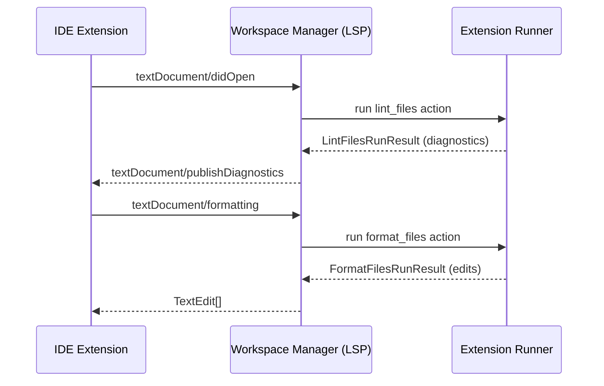

# IDE Integration

FineCode exposes a standard **Language Server Protocol (LSP)** server that IDE extensions connect to. This gives you real-time diagnostics, code actions, formatting, and more — powered by the same tool configurations you use in the CLI.

## VSCode

Install the [FineCode VSCode extension](https://github.com/finecode-dev/finecode-vscode).

The extension:

- Automatically starts the FineCode LSP server when you open a workspace
- Shows linting diagnostics inline as you type
- Provides quick-fix code actions
- Formats files on save (when configured)
- Exposes the FineCode action tree in the sidebar

### Requirements

- FineCode installed in your `dev_workspace` venv (see [Getting Started](getting-started.md))
- `prepare-envs` run at least once so handler venvs are set up

### Configuration

The extension discovers the `dev_workspace` venv automatically from `.venvs/dev_workspace/`. No per-project extension configuration is required — everything comes from `pyproject.toml`.

## How the LSP server works



The WM translates LSP requests into FineCode actions and delegates execution to the appropriate Extension Runner. Results are translated back into LSP responses.

## Starting the server manually

If you need to connect a custom client or debug the server:

```bash
# stdio (most common for LSP clients)
python -m finecode start-api --stdio

# TCP (useful for debugging)
python -m finecode start-api --socket 2087

# WebSocket
python -m finecode start-api --ws --port 2087
```

## MCP server

FineCode also supports the **Model Context Protocol (MCP)**, which allows AI agents to invoke FineCode actions directly.

```bash
python -m finecode start-api --stdio --mcp --mcp-port 3000
```

This starts both the LSP server (for IDE) and an MCP server simultaneously.
